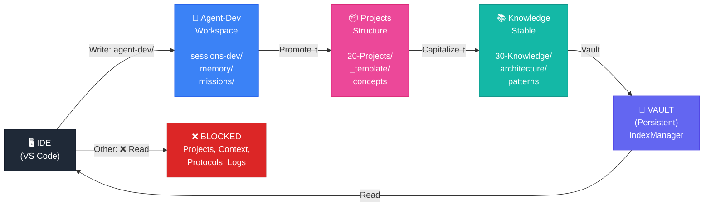
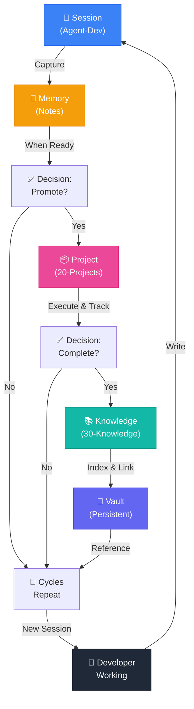
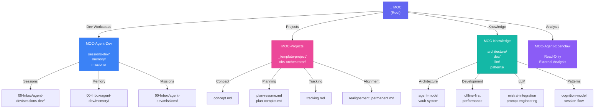
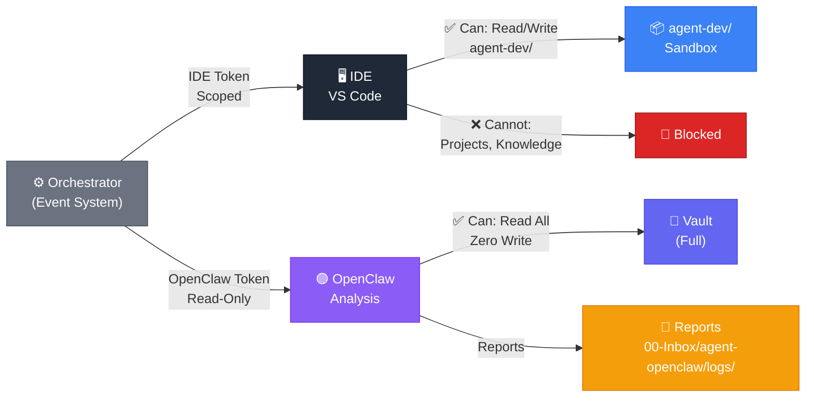
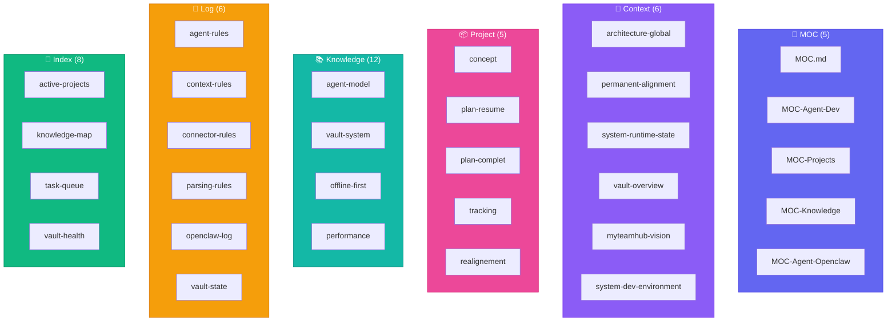
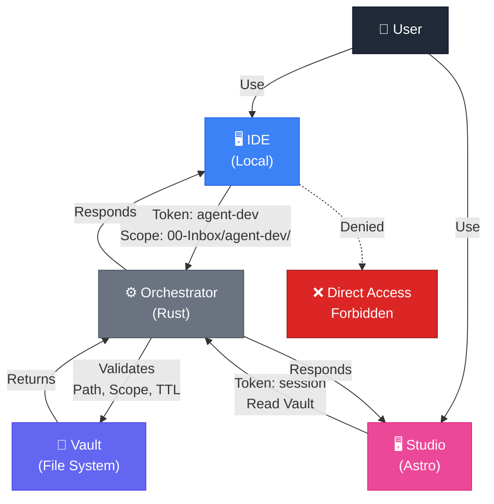
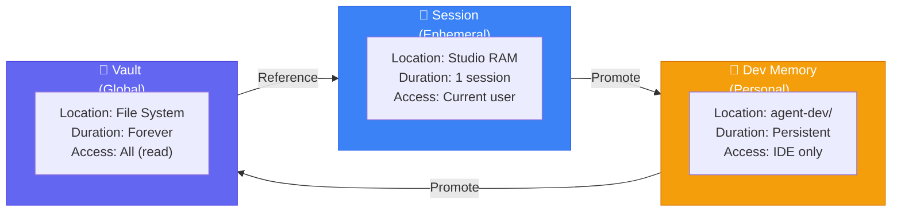
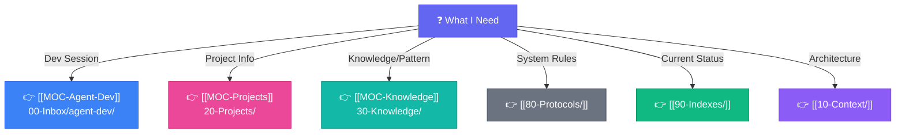

# 🗺️ Vault Architecture & Navigation Graph

> Vue d'ensemble complète du Vault avec diagrammes Mermaid  
> 🧭 Navigation • 📊 Flux • 🔗 Relations

---

## 📊 1. VUE GÉNÉRALE DU VAULT (10 Directories)

```mermaid
graph TB
    MOC["🧠 MOC (Root)<br/>Master of Ceremonies"]
    
    MOC -->|"📋 Navigation"| A["<b>00-Inbox</b><br/>Entry Points"]
    MOC -->|"🧭 Contexte"| B["<b>10-Context</b><br/>System State"]
    MOC -->|"📦 Structure"| C["<b>20-Projects</b><br/>Planning"]
    MOC -->|"📚 Knowledge"| D["<b>30-Knowledge</b><br/>Stable Info"]
    MOC -->|"💾 Assets"| E["<b>40-Snippets</b><br/>Code Library"]
    MOC -->|"✅ Tasks"| F["<b>50-Tasks</b><br/>Todo"]
    MOC -->|"🔍 Status"| G["<b>60-State</b><br/>System State"]
    MOC -->|"📝 History"| H["<b>70-Logs</b><br/>History"]
    MOC -->|"🔐 Rules"| I["<b>80-Protocols</b><br/>Rules"]
    MOC -->|"🧩 Discovery"| J["<b>90-Indexes</b><br/>Navigation"]
    
    A -.-> A1["agent-dev<br/>(IDE workspace)"]
    A -.-> A2["agent-openclaw<br/>(Analysis)"]
    A -.-> A3["myteam-studio<br/>(UI workspace)"]
    
    B -.-> B1["architecture-global"]
    B -.-> B2["permanent-alignment"]
    B -.-> B3["system-runtime-state"]
    
    C -.-> C1["_template-project"]
    C -.-> C2["obs-orchestrator"]
    
    D -.-> D1["architecture/"]
    D -.-> D2["dev/"]
    D -.-> D3["llm/"]
    D -.-> D4["patterns/"]
    
    style MOC fill:#6366f1,stroke:#4f46e5,color:#fff
    style A fill:#3b82f6,stroke:#2563eb,color:#fff
    style B fill:#8b5cf6,stroke:#7c3aed,color:#fff
    style C fill:#ec4899,stroke:#db2777,color:#fff
    style D fill:#14b8a6,stroke:#0d9488,color:#fff
    style E fill:#f59e0b,stroke:#d97706,color:#fff
    style F fill:#ef4444,stroke:#dc2626,color:#fff
    style G fill:#06b6d4,stroke:#0891b2,color:#fff
    style H fill:#8b5cf6,stroke:#6d28d9,color:#fff
    style I fill:#6b7280,stroke:#4b5563,color:#fff
    style J fill:#10b981,stroke:#059669,color:#fff
```

---

## 🧭 2. ARCHITECTURE COGNITIVE (3 COUCHES)

---

## 🔄 3. FLUX DE DONNÉES (Session → Project → Knowledge)

---

## 🧭 4. MOC NAVIGATION STRUCTURE

---

## 🔌 5. CONNECTEURS EXTERNES

---

## 📊 6. FILE TYPES & DISTRIBUTION

---

## 🔒 7. SECURITY & ACCESS CONTROL

---

## 🧠 8. CONTEXT LAYERS

---

## 🚀 9. QUICK REFERENCE: WHERE TO FIND THINGS

---

## 📋 10. FILE ORGANIZATION SUMMARY

| Directory | Purpose | Type | Access |
|-----------|---------|------|--------|
| **00-Inbox** | Entry points | Temporary | IDE write |
| **10-Context** | System state | Context | Read-only |
| **20-Projects** | Planning | Structure | Manual |
| **30-Knowledge** | Stable info | Permanent | Reference |
| **40-Snippets** | Code library | Assets | Reference |
| **50-Tasks** | Todo tracking | Tasks | Manual |
| **60-State** | Runtime state | Logs | Event-based |
| **70-Logs** | History | Logs | Event-based |
| **80-Protocols** | System rules | Documentation | Reference |
| **90-Indexes** | Navigation | Discovery | Auto-generated |

---

## 🎯 KEY PRINCIPLES

✅ **Separation of Concerns**
- Each directory has one responsibility
- Clear boundaries between layers
- No circular dependencies

✅ **Single Context Model**
- One active editor context at a time
- Session state = Editor content
- No global implicit state

✅ **Explicit Promotion**
- Nothing auto-migrates
- Session → Project → Knowledge via manual promotion
- Clear versioning at each step

✅ **Read-Only Safety**
- IDE restricted to agent-dev/
- External analyzers (OpenClaw) read-only
- All access validated by Orchestrator

✅ **Persistence Model**
- Session = RAM (ephemeral)
- Dev Memory = agent-dev/ (personal)
- Vault = File System (permanent)
- No duplication between layers

---

## 🔗 REFERENCES

👉 [[MOC]] — Master entry point  
👉 [[00-Inbox/agent-dev/MOC-Agent-Dev]] — Dev workspace guide  
👉 [[20-Projects/MOC-Projects]] — Project structure guide  
👉 [[30-Knowledge/MOC-Knowledge]] — Knowledge base guide  
👉 [[10-Context/permanent-alignment]] — Design principles  
👉 [[80-Protocols/parsing-rules]] — File format rules  

---

**Generated**: 2026-04-19  
**Status**: Production Reference  
**Audience**: Future users & developers
